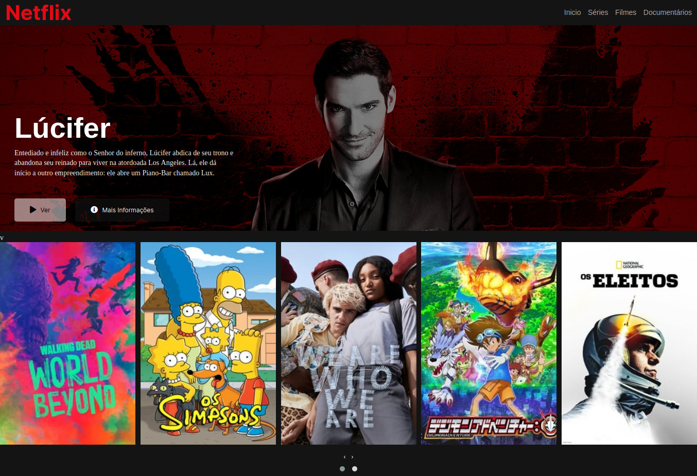

<p align="center">
  <a href="https://www.twitter.com/codder404/">
    
  </a>
    
   
   <a href="https://github.com/codder404/netflix-ui.git/stargazers">
    
  </a>
  
 
</p>
<h1 align="center">
    
</h1>

<h4 align="center"> 
  Netflix Clone
</h4>

<p align="center">
 <a href="#-sobre-o-projeto">Sobre</a> • 
 <a href="#-como-executar-o-projeto">Como executar</a> • 
 <a href="#-tecnologias">Tecnologias</a> • 
 <a href="#-autor">Autor</a> • 
 <a href="#user-content--licença">Licença</a>
</p>

## 💻 Sobre o projeto

🚀 Netflix - é uma provedora global de filmes e séries de televisão via streaming sediada em Los Gatos, Califórnia, e que atualmente possui mais de 160 milhões de assinantes.

Projeto desenvolvido durante **O Curso da Digital Innovation One**

---

## 🚀 Como executar o projeto

Este projeto é divido em uma parte:

1. Frontend

### Pré-requisitos

Antes de começar, você vai precisar ter instalado em sua máquina as seguintes ferramentas:
[Git](https://git-scm.com), [Node.js](https://nodejs.org/en/).
Além disto é bom ter um editor para trabalhar com o código como [VSCode](https://code.visualstudio.com/)

#### 🧭 Rodando a aplicação

```bash

# Clone este repositório
$ git clone git@github.com:codder404/netflix-ui.git

# Acesse a pasta do projeto no seu terminal/cmd
$ cd netflix-ui
```

---

## 🛠 Tecnologias

As seguintes ferramentas foram usadas na construção do projeto:

#### **Website** ([HTML](https://www.w3schools.com/html/))

- **[HTML](https://www.w3schools.com/html/)**
- **[CSS](https://www.w3schools.com/css/)**
- **[JQuery](https://jquery.com/)**
- **[TMDB](https://www.themoviedb.org/?language=pt)**

> Veja o arquivo [package.json](https://github.com/tgmarinho/README-ecoleta/blob/master/web/package.json)

#### [](https://github.com/tgmarinho/Ecoleta#utilit%C3%A1rios)**Utilitários**

- Protótipo: **[Netflix](https://www.netflix.com/)**
- API: **[Imagens](https://www.themoviedb.org/?language=pt)**
- Editor: **[Visual Studio Code](https://code.visualstudio.com/)**
- Markdown: **[StackEdit](https://stackedit.io/)**, **[Markdown Emoji](https://gist.github.com/rxaviers/7360908)**

---


